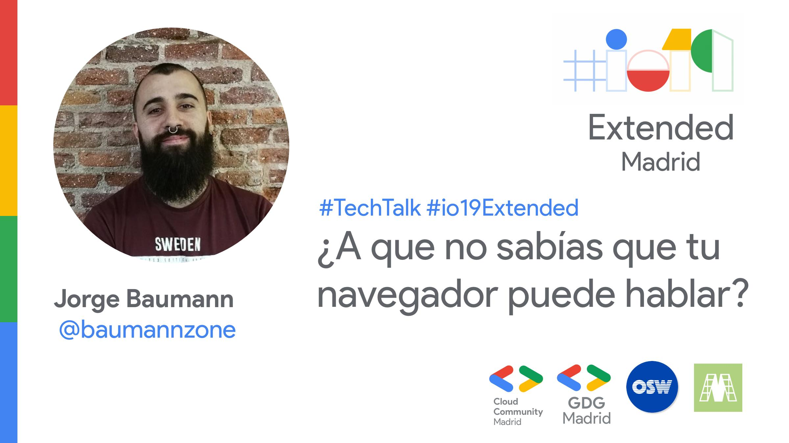

---

title: About ABA
description: Know the story behind this project

---

Mediados del año 2018. La historia comienza cuando recibo una llamada telefónica por parte de una empresa que estaba interesada en contratarme. 
Me comentan que parte de la entrevista consiste en hacer una breve presentación al equipo de técnico de algún tema que me interese, de libre elección, no necesariamente técnico.

_¡Qué buena idea, pensaba yo!_ Realmente me parece una buena forma de conocer un poco más al candidato y que el propio candidato
conozca al equipo con el que va a trabajar.

Dado que el puesto es de desarrollador, empiezo a buscar algo relacionado con tecnologías web (mi area de expertise) que pueda ser divertido y
que llame la atención.  
Decido presentarles como proyecto la API de texto a voz del navegador (_Web Speech API_) y creo este repositorio en github ([https://github.com/baumannzone/2awesome4u](https://github.com/baumannzone/2awesome4u))
que cuya demo esta url ([https://web-speech-api-js.netlify.app/#/](https://web-speech-api-js.netlify.app/#/)).  
Poco tiempo después, esta demo se convierte en un _blog-post_ en Medium ([https://medium.com/@baumannsito/make-your-browser-talk-with-javascript](https://medium.com/@baumannsito/make-your-browser-talk-with-javascript-614546028076)).

Un par de meses después, en mayo de 2019, [Carlos Azaustre](https://carlosazaustre.es/about), me invita a dar una charla en una de las [comunidades de Google](https://www.meetup.com/es-ES/gcdcmadrid/events/260366402/) en Madrid, con motivo del __#io19__ extended.  

  

Con la base de código que tenía y con los ejemplos, empiezo a investigar y el resultado es este proyecto, en el que comparto funcionalidades del navegador que me parecen curiosas.

Como diría el majo de [Rafa Garcés](https://twitter.com/rafagarces) en su Newsletter de [#MyTwoCents](https://rafagarces.us8.list-manage.com/subscribe?u=cb8dd9dbb231f1c48a7ddb835&id=1a2645687a) (que por cierto, está to' guapa), "**Sharing is caring ✨**".  
Por lo tanto, si te ha gustado, te animo a que compartas esto en tus redes sociales y con tus contactos de trabajo.

