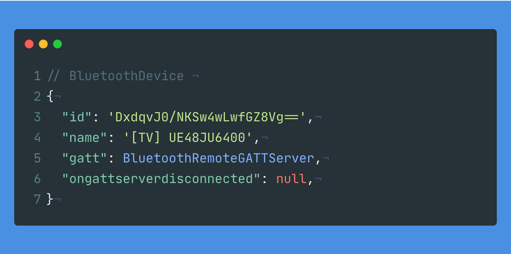

---

title: Bluetooth API 📶
sidebar: auto

---

# Bluetooth API 📶
> aka Web Bluetooth API

::: tip
The Web Bluetooth API provides the ability to connect and interact with Bluetooth Low Energy (BLE) peripherals.
:::

## Examples

### Demo #1
> Bluetooth simple demo

<API-Bluetooth-Example1 />

::: details Code
```js
navigator.bluetooth.requestDevice({acceptAllDevices: true})
  .then((device) => {
    this.name = device.name
    console.log(device)
  })
```

---


:::
